# Deutsch Grammatik
A website for practicing German grammar using spaced repetition.
[Try it out](http://www.erikshelley.com/deutschgrammatik/).

## Motivation
Spaced repetition flash card software is helpful for learning vocabulary but it is not ideal for learning grammar.
I decided to build a spaced repetition system for learning grammar rules that varies the content of the flash
card for a given rule each time it is seen while keeping the content applicable for that rule.

## Grammar Topics
- [x] Deklination (Declension)
  - [x] Identify Gender
  - [ ] Identify Case
  - [ ] Identify Declension
- [ ] Konjugation (Conjugation)
  - [ ] Topics TBD
- [ ] Wortstellung (Word Order)
  - [ ] Topics TBD

## Features
- [x] Spaced Repetition for Rules and Exceptions
- [x] Progress Tracking For Signed In Users (Items Reviewed, Items Learned, Reviews Due)
- [x] Responsive Design (Mobile Friendly)
- [x] 5,000 Most Commonly Used German Nouns
- [x] 44 Gender Rules Covering ~60% of the 5,000 Nouns
- [ ] Sample Sentences for Identifying Cases and Declension
- [ ] Automatic Detection of Obvious Cases in Sample Sentences
- [ ] Ability to Manually Confirm Ambiguous Cases in Sample Sentences
- [ ] Save Time Zone Information per User
- [ ] Future Work: Conjugation and Word Order

## Screenshots

  
Guest User

  <a href="screenshots/guest-homepage.png">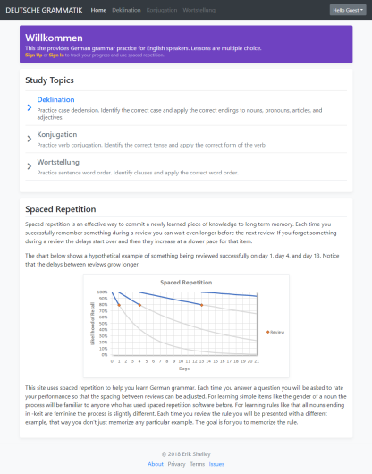</a>
  
  <a href="screenshots/guest-genderquiz-question.png">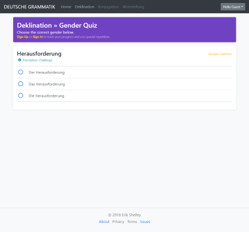</a>
  <a href="screenshots/guest-genderquiz-answer.png">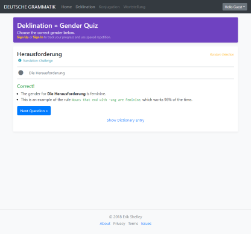</a>
  <a href="screenshots/guest-genderquiz-dictionary.png">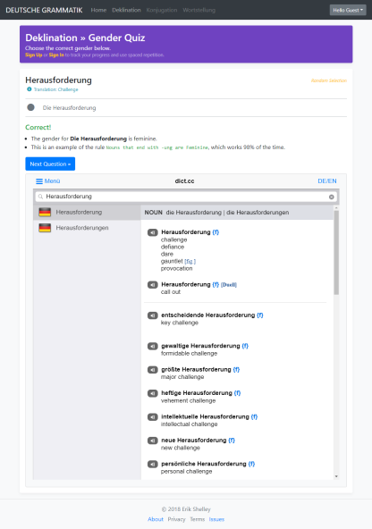</a>

  
Authorized User

  <a href="screenshots/user-homepage.png">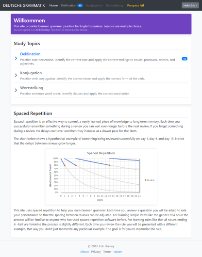</a>
  <a href="screenshots/user-homepage-nextreviewdue.png">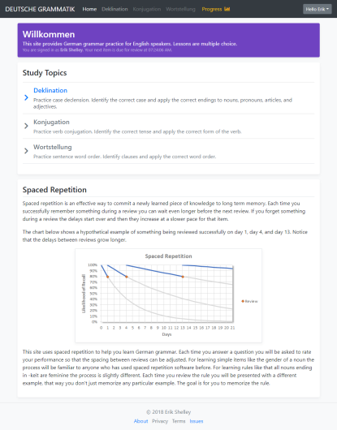</a>
  <a href="screenshots/user-deklination.png">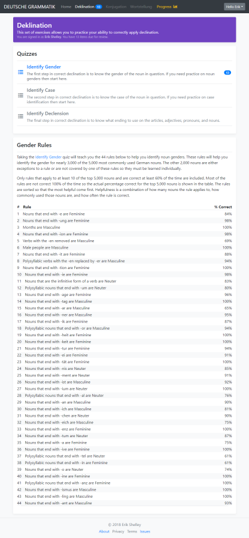</a>
  <a href="screenshots/user-genderquiz-question.png">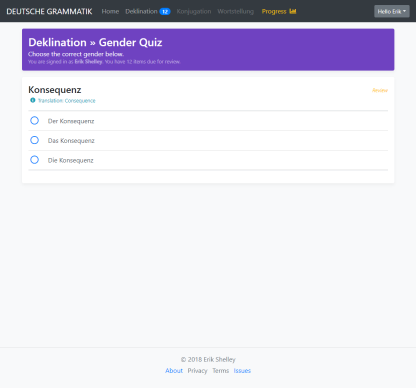</a>
  <a href="screenshots/user-genderquiz-answer-correct.png">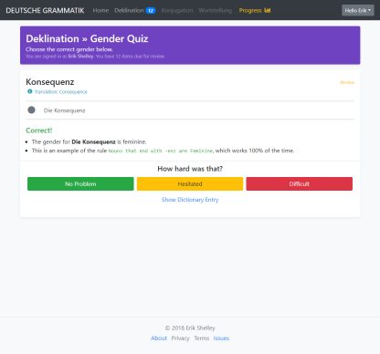</a>
  <a href="screenshots/user-genderquiz-answer-incorrect.png">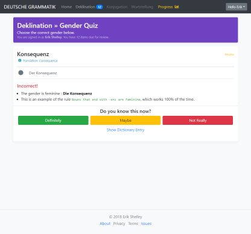</a>
  
  <a href="screenshots/user-genderquiz-answer-norule.png">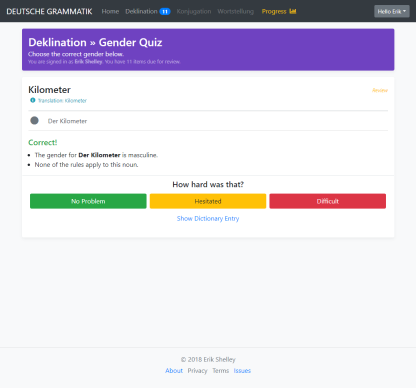</a>
  <a href="screenshots/user-progress.png">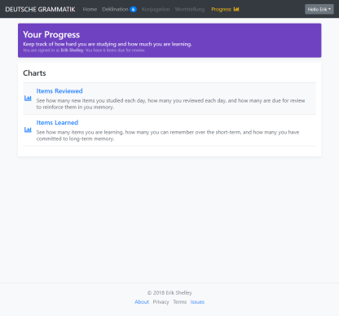</a>
  <a href="screenshots/user-progress-reviewed.png">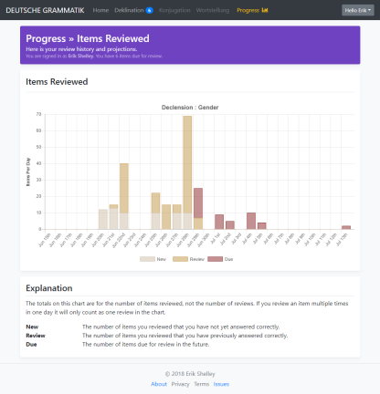</a>
  <a href="screenshots/user-progress-learned.png">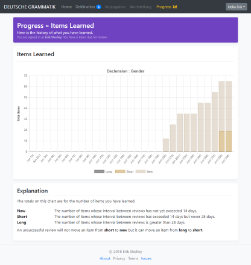</a>

  
Mobile

  <a href="screenshots/user-genderquiz-dictionary-mobile.png">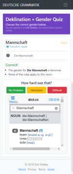</a>
  <a href="screenshots/user-genderquiz-dictionary-mobile-rotated.png">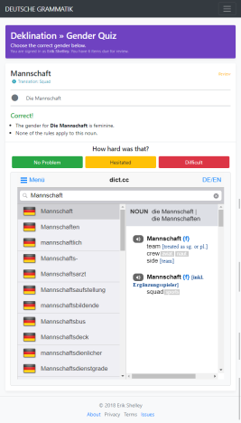</a>

## How to Use
For the moment this project is not meant to be downloaded and installed.
Instead a [working version](http://www.erikshelley.com/deutschgrammatik/) is available for use.

## Frameworks/Tools Used
* [Django](https://www.djangoproject.com/)
* [Bootstrap](https://getbootstrap.com/)
* [Django-JChart](https://github.com/matthisk/django-jchart)
* [Font Awesome](https://fontawesome.com/)

## License
The code in this project is licensed under the [GNU General Public License v3.0](LICENSE).

